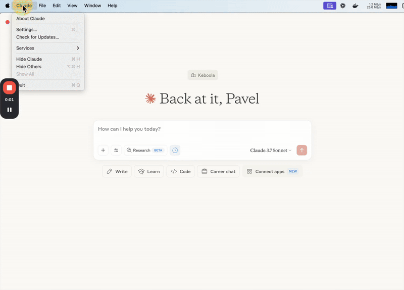

<p align="center">
  
</p>

# Keboola MCP Server

> Connect your AI agents, MCP clients (**Cursor**, **Claude**, **Windsurf**, **VS Code** ...) and other AI assistants to Keboola. Expose data, transformations, SQL queries, and job triggers—no glue code required. Deliver the right data to agents when and where they need it.

<p align="center">
  
</p>

# What Is This?
Keboola MCP Server is an open-source bridge between your Keboola project and modern AI tools. It turns Keboola features—like storage access, SQL transformations, and job triggers—into callable tools for Claude, Cursor, CrewAI, LangChain, Amazon Q, and more.

> This is where data engineering feels less like coding—and more like just writing one last prompt.

## Compatibility
### Integration with Other Platforms

The Keboola MCP Server can be integrated with nearly any platform that supports the MCP protocol.

#### Agent Frameworks
- **[CrewAI](https://github.com/crewAIInc/crewAI-tools#crewai-tools-and-mcp)**(fully supported, tested): Add Keboola as a custom tool provider to your agent crew.
- **[LangChain](https://github.com/langchain-ai/langchain-mcp-adapters)**(fully supported, tested): Use Keboola MCP via MCP Adapters in your LangChain applications.
- **[AutoGen](https://microsoft.github.io/autogen/dev//user-guide/agentchat-user-guide/tutorial/agents.html#using-tools-and-workbench)**: Register Keboola MCP Server with AutoGen's **AssistantAgent**.
- **[OpenAI](https://openai.github.io/openai-agents-python/mcp/)**: Added Keboola MCP Server to Agents.
- **[Amazon Q – Generative AI Assistant](https://aws.amazon.com/blogs/devops/extend-the-amazon-q-developer-cli-with-mcp/)**: Configure Keboola MCP Server and start using it from Amazon Q Developer CLI.


#### Automation Platforms
- **[n8n](https://github.com/nerding-io/n8n-nodes-mcp)**(fully supported, tested): Use HTTP nodes to query data or trigger transformations.
- **[Vercel](https://ai-sdk.dev/docs/ai-sdk-core/tools-and-tool-calling#mcp-tools)**(fully supported, tested): Build apps on top of Keboola MCP Server in minutes.
- **[Gumloop](https://github.com/gumloop/guMCP/tree/main/src/servers)**(Experimental): Add Keboola MCP as a node in Gumloop and use it in your workflows.

**Other Integrations**: All platforms can connect to Keboola MCP Server via HTTP + Server-Sent Events (SSE) or stdio, making integration seamless regardless of programming language or environment.

> Currently, no hosted remote MCP Server is provided. A hosted solution may become available in the future.

### Development Environments & Clients

| **Environment** | **Support Status** |
|-------------|---------------|
| **Data Backends**  |
| Snowflake, BigQuery | ✅ Native support (no data movement) |
| Other databases | ✅ Supported (via Extractors, Writers & Apps) |
| **Operating Systems**  |
| macOS, Linux, Windows | ✅ Fully supported, tested |
| **MCP Clients (AI Assistants)**  |
| Claude (Desktop & Web), Cursor, | ✅ Fully supported, tested |
| Windsurf, Zed, Replit, Codeium, Sourcegraph | ✅ Supported |
| Custom Clients | ✅ Via MCP  |

---

## 🚀 Quick Start Guide

### 1. Get Your Keboola Token (Easiest Method)
1.1. Use the Keboola Playground: [https://chat.canary-orion.keboola.dev/](https://chat.canary-orion.keboola.dev/)
1.2. Sign in using Google. (If your goal is to just experiment with data or your project in chat, this is it.)
1.3. Click your profile (bottom-left).
1.4. Copy:
    - KBC_STORAGE_TOKEN
    - KBC_WORKSPACE_SCHEMA
1.5. Create a .env file:
```bash
KBC_STORAGE_TOKEN=your_token_here
KBC_WORKSPACE_SCHEMA=your_workspace_schema_here
```

### 2. Install and Run
2.1 Create Virtual Environment & Install Keboola MCP Server
```bash
python3 -m venv .venv && source .venv/bin/activate
pip3 install keboola_mcp_server

# Run server
uvx keboola_mcp_server --api-url https://connection.canary-orion.keboola.dev
```
2.2 Set Required Variables
```bash
export KBC_STORAGE_TOKEN=your_token_here
export KBC_WORKSPACE_SCHEMA=your_workspace_schema_here
export GOOGLE_APPLICATION_CREDENTIALS=your_google_credentials
```

2.3 Configure Claude
- Go to Settings / Developer / Edit Config.
- Add Keboola MCP Server to the config file.

```json
{
  "mcpServers": {
    "keboola": {
      "command": "uvx",
      "args": [
        "keboola_mcp_server",
        "--api-url",
        "https://connection.canary-orion.keboola.dev"
      ],
      "env": {
        "KBC_STORAGE_TOKEN": "your_keboola_storage_token",
        "KBC_WORKSPACE_SCHEMA": "your_workspace_schema"
      }
    }
  }
}
```
2.4 Restart Claude
2.5 Ask your first question: "What is in my project?" and get perfect answer describing your empty project.
2.6 Success

## Full Installation Instructions

### 0. Prerequisites

- A Keboola account with **Storage API token**
- (Optional) A Keboola workspace with Snowflake or BigQuery

#### Python & uv
- Python 3.10 or newer
- [uv](https://github.com/astral-sh/uv)

#### Containerized In Docker
1. To run the server in a container, you will need to have [Docker installed](https://docs.docker.com/engine/install/).
2. Once Docker is installed, you will also need to ensure Docker is running. The Docker image is publicly accessible. If you encounter authentication errors during pull, ensure you're logged out of private registries with `docker logout ghcr.io`.

### 1. Get Keboola Storage API Token
Keboola has various token types; MCP Server requires a valid **Storage API Token**.

#### 1.1 Sign Up To Get API Token
1. Sign up for Keboola at chat.keboola.com with a valid Google account.
2. Navigate to your profile in bottom left.
3. There you can see your `KBC_WORKSPACE_SCHEMA` and click on `get my token`.

### 1.2 Get Storage API Token via CLI
1. Install [Keboola CLI](https://developers.keboola.com/cli/installation/).
2. Run `kbc local get-token --email=you@example.com` (requires Google SSO).
3. Your `KBC_STORAGE_TOKEN` and `KBC_WORKSPACE_SCHEMA` are saved in a `.env` file in the current directory.

#### 1.3 Get Storage API Token For Existing Keboola Project
1. Navigate to your project.
2. Click on your profile icon in the top right corner.
3. Go to project Settings.
4. Select API Tokens.
5. Create a new **Storage API Token** and give it a name (allow full access to all components and buckets).
6. Click on create.
7. Create a SQL workspace.
8. Click on connect and copy the WORKSPACE_SCHEMA.

### 2. Required Environment Variables

| Variable | Required | Description |
|----------|----------|-------------|
| `KBC_STORAGE_TOKEN` | Yes | Your Keboola Storage API token |
| `KBC_WORKSPACE_SCHEMA` | For queries | Your Keboola workspace schema name |
| `GOOGLE_APPLICATION_CREDENTIALS` | For BigQuery | Path to Google credentials JSON file |


### 3. Installation Options

#### 3.1 Option A: Using pip (Recommended)
##### 3.1.1 Python Installation With `uv`
`uv` ensures a fast, clean, and dependency-resolved setup of the MCP Server without polluting global Python packages.
[Follow](https://docs.astral.sh/uv/getting-started/installation/) the steps for your OS.

##### 3.1.2 Install Keboola MCP with `uv`
```bash

# Setup virtual environment
python3 -m venv --upgrade-deps .venv
source .venv/bin/activate  # On Windows: .venv\Scripts\activate

# Install the MCP server
pip3 install keboola_mcp_server

# Start the server
uvx keboola_mcp_server --api-url https://connection.YOUR_REGION.keboola.com
```

> Note: If you are using a specific version of Python (e.g., 3.11 due to some package compatibility issues), you'll need to update the command to use that specific version, for example `python3.11 -m venv --upgrade-deps .venv` and `pip3.11 install keboola_mcp_server`.


#### 3.2 Option B: Using Docker

```bash
docker pull keboola/mcp-server:latest

docker run -it \
  -e KBC_STORAGE_TOKEN="YOUR_KEBOOLA_STORAGE_TOKEN" \
  -e KBC_WORKSPACE_SCHEMA="YOUR_WORKSPACE_SCHEMA" \
  keboola/mcp-server:latest \
  --api-url https://connection.YOUR_REGION.keboola.com
```


> Replace:
> `YOUR_KEBOOLA_STORAGE_TOKEN` with your Keboola Storage API token.
> `YOUR_WORKSPACE_SCHEMA` with your Snowflake schema or BigQuery dataset of your workspace.

**Regions**
Replace `YOUR_REGION` in the API URL with your Keboola deployment region:
- AWS North America: `https://connection.keboola.com`
- AWS Europe: `https://connection.eu-central-1.keboola.com`
- Google Cloud EU: `https://connection.europe-west3.gcp.keboola.com`
- Google Cloud US (Pay As You Go): `https://connection.us-east4.gcp.keboola.com`
- Azure EU (Pay As You Go): `https://connection.north-europe.azure.keboola.com`


---

## Integrating with popular MCP Clients

### Claude Desktop Configuration

```json
{
  "mcpServers": {
    "keboola": {
      "command": "uvx",
      "args": [
        "keboola_mcp_server",
        "--api-url",
        "https://connection.YOUR_REGION.keboola.com"
      ],
      "env": {
        "KBC_STORAGE_TOKEN": "your_keboola_storage_token",
        "KBC_WORKSPACE_SCHEMA": "your_workspace_schema"
      }
    }
  }
}
```

### Claude Desktop Configuration (with Docker)

```json
{
  "mcpServers": {
    "keboola": {
      "command": "docker",
      "args": [
        "run",
        "--rm",
        "-i",
        "-e", "KBC_STORAGE_TOKEN",
        "-e", "KBC_WORKSPACE_SCHEMA",
    "keboola/mcp-server:latest",
    "--api-url", "https://connection.${REGION}.keboola.com"
  ],
  "env": {
        "KBC_STORAGE_TOKEN": "your_keboola_storage_token",
        "KBC_WORKSPACE_SCHEMA": "your_workspace_schema",
        "REGION": "your_region"
      }
    } 
}
```

### Cursor Integration

1. Open Settings → Features → MCP Servers.
2. Click "+ Add new global MCP Server".
3. Fill in the configuration details similar to the Claude example above.
4. Restart Cursor

---

## Supported Tools Inside Keboola MCP Server
LLMs, agents, and users can combine all these tools to help you achieve your goals.
| Category | Tool | Description |
|----------|------|-------------|
| **Storage** | `retrieve_buckets` | Lists all storage buckets in your Keboola project with their IDs, names, and metadata. |
| | `get_bucket_detail` | Retrieves comprehensive information about a specific bucket including tables, permissions, and statistics. |
| | `retrieve_bucket_tables` | Returns all tables within a specific bucket along with their row counts and last update times. |
| | `get_table_detail` | Provides detailed schema information, column types, primary keys, and database identifiers for SQL queries. |
| | `update_bucket_description` | Adds or modifies the description for a bucket to improve documentation and governance. |
| | `update_table_description` | Sets or updates the description text for tables to document their purpose and structure. |
| **SQL** | `query_table` | Executes custom SQL queries against tables in your workspace and returns formatted results. |
| | `waii_query` | Advanced tool to generate SQL, while understanding table content, relations, and lineage (in development). |
| | `get_sql_dialect` | Identifies whether your workspace uses Snowflake or BigQuery SQL dialect for proper query syntax. |
| **Component** | `retrieve_components` | Lists all available extractors, writers, and applications with their configurations. |
| | `retrieve_transformations` | Returns all transformation configurations available in your project organized by type. |
| | `get_component_details` | Provides detailed configuration information and parameters for a specific component. |
| | `create_sql_transformation` | Creates a new SQL transformation with custom queries, scheduling, and input/output mapping. |
| | `create_component_configuration` | Creates a new component configuration, allowing data extraction and writing. |
| **Job** | `retrieve_jobs` | Lists and filters jobs by status, component, configuration ID with support for pagination. |
| | `get_job_detail` | Returns comprehensive details about a specific job including logs, performance metrics, and results. |
| | `start_job` | Triggers a component or transformation job to run with specified parameters and configurations. |
| **Documentation** | `docs_query` | Searches and retrieves relevant Keboola documentation based on natural language queries. |

> Full tool catalog: docs/tools.md


---

## 🛠️ Troubleshooting & Debugging

### Common Issues

| Issue | Solution |
|-------|----------|
| **Authentication Errors**, **Token Not Found** | Verify your `KBC_STORAGE_TOKEN` and URL environment variables are set and valid. |
| **Workspace Issues** | Confirm `KBC_WORKSPACE_SCHEMA` is correct and accessible. |
| **Connection Timeout** | Check network connectivity to your Keboola region. |
| **SQL Query Errors** | Verify SQL dialect matches your backend (Snowflake/BigQuery). |

### Debugging Tools

```bash
# Set your Keboola token (required)
export KBC_STORAGE_TOKEN=your_token_here

# Run with debug logging
uvx keboola_mcp_server --api-url https://connection.YOUR_REGION.keboola.com --log-level DEBUG

# Use MCP Inspector to test
npx @modelcontextprotocol/inspector uvx keboola_mcp_server --api-url https://connection.YOUR_REGION.keboola.com
```

### Environment Variables
This table is repeated from the "Quick Start Guide" for easy reference during troubleshooting.
| Variable | Required | Description |
|----------|----------|-------------|
| `KBC_STORAGE_TOKEN` | Yes | Your Keboola Storage API token |
| `KBC_WORKSPACE_SCHEMA` | For queries | Your Keboola workspace schema name |
| `GOOGLE_APPLICATION_CREDENTIALS` | For BigQuery | Path to Google credentials JSON file |

### BigQuery support
If your Keboola project uses BigQuery backend you will need to set GOOGLE_APPLICATION_CREDENTIALS environment variable in addition to KBC_STORAGE_TOKEN and KBC_WORKSPACE_SCHEMA.

Go to your Keboola BigQuery workspace and display its credentials (click Connect button).
Download the credentials file to your local disk. It is a plain JSON file.
Set the full path of the downloaded JSON credentials file to GOOGLE_APPLICATION_CREDENTIALS environment variable.
This will give your MCP server instance permissions to access your BigQuery workspace in Google Cloud.


---

# Keboola Core
A high-level overview of what capabilities are exposed via the MCP Server from the underlying Keboola Core.
<p align="center">
  
</p>

---

## 🔗 Stay In Touch

  [LinkedIn](https://www.linkedin.com/company/keboola)•
  [X](https://x.com/keboola) •
  [Changelog](https://changelog.keboola.com/) •
  [Create issue](https://github.com/keboola/mcp-server/issues/new)


---

## 🧭 Want To Go Further?

- 📘 [User Docs](https://docs.keboola.com/)
- 📘 [Developer Docs](https://developers.keboola.com/)
- 🌐 [Keboola Platform](https://www.keboola.com)
- 🛠 [Keboola Playground](https://chat.canary-orion.keboola.dev/)
- 🛠 [Create issue](https://github.com/keboola/mcp-server/issues/new)
