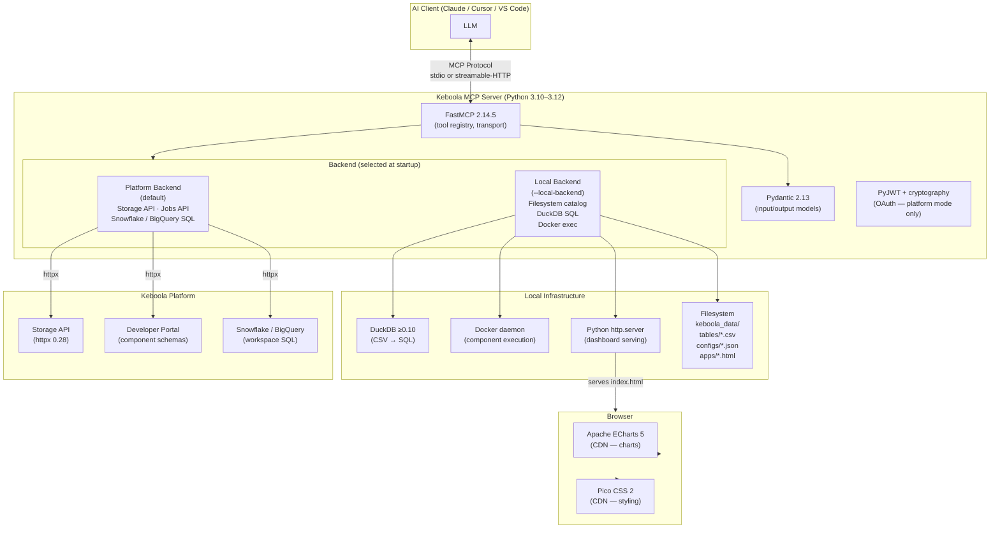
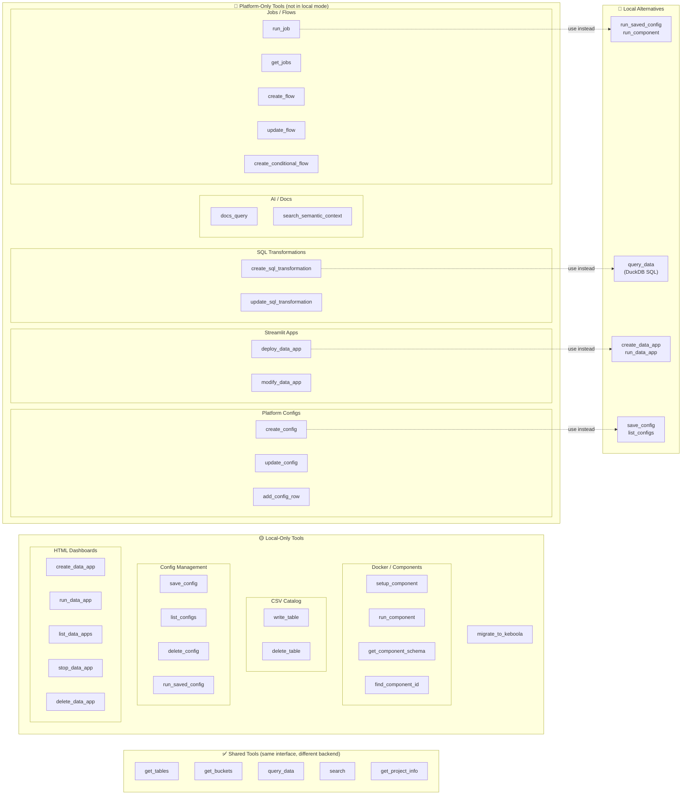
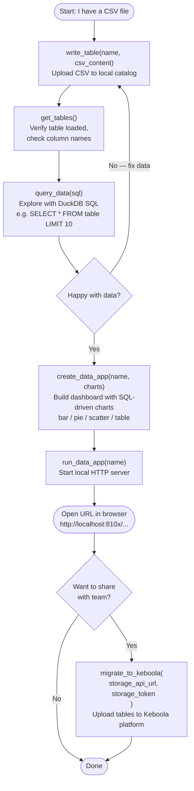
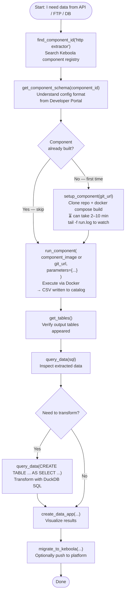
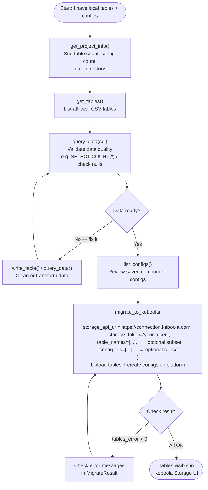
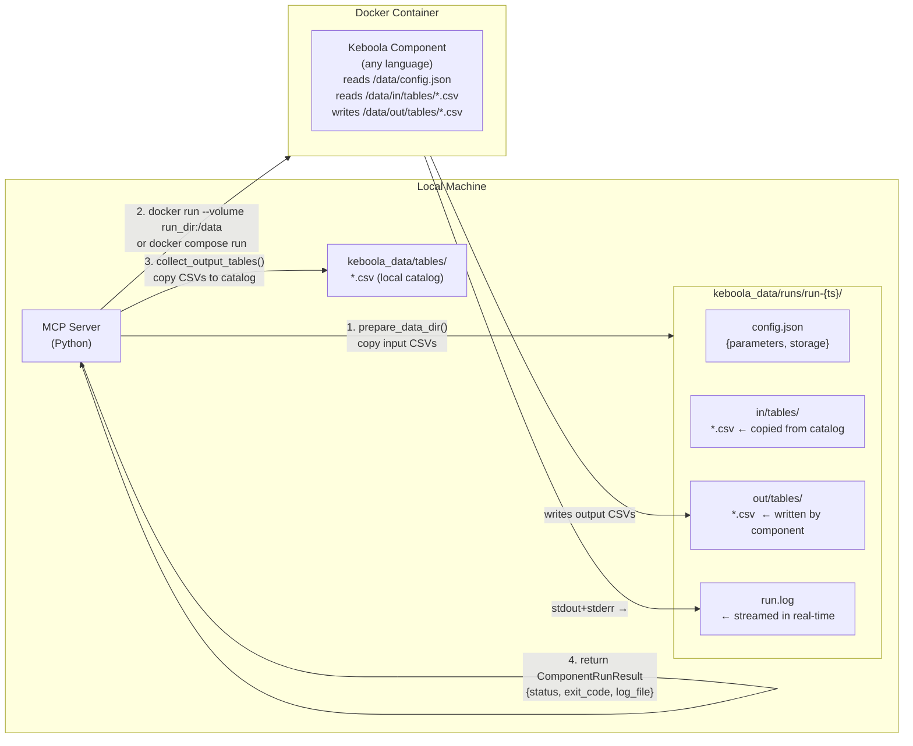

# Architecture Diagrams — Keboola MCP Server

All diagrams use [Mermaid](https://mermaid.js.org/) syntax (rendered by GitHub, VS Code, Obsidian, etc.).

---

## 1. Tech Stack



---

## 2. Tool Surface — Local vs Platform



---

## 3. Data App — End-to-End Flow

```mermaid
sequenceDiagram
    actor User
    participant LLM as LLM (Claude)
    participant MCP as MCP Server (Python)
    participant DuckDB as DuckDB Engine
    participant FS as Filesystem<br/>keboola_data/
    participant HTTP as Python http.server<br/>(background process)
    participant Browser as Browser

    User->>LLM: "Create a dashboard for iris data"
    LLM->>MCP: create_data_app(name, title, charts[{sql, type, ...}])

    loop For each chart
        MCP->>DuckDB: execute SQL query
        DuckDB->>FS: read tables/*.csv
        DuckDB-->>MCP: {columns, rows} as Python dict
    end

    MCP->>MCP: generate_dashboard_html(config, chart_data)<br/>embed data as JSON in &lt;script type="application/json"&gt;<br/>escape &lt;/ → &lt;\/ (XSS prevention)
    MCP->>FS: write apps/iris-dashboard/index.html
    MCP->>FS: write apps/iris-dashboard/app.json
    MCP-->>LLM: {status: "ok", app_url: "http://localhost:8101/..."}

    LLM->>MCP: run_data_app("iris-dashboard")
    MCP->>MCP: find free port 8101-8199<br/>(socket.bind test)
    MCP->>HTTP: Popen(['python','-m','http.server','8101'], cwd=keboola_data/)
    MCP->>FS: register PID in apps/.running.json
    MCP-->>LLM: {url: "http://localhost:8101/apps/iris-dashboard/", port: 8101}
    LLM-->>User: "Open http://localhost:8101/apps/iris-dashboard/"

    User->>Browser: open URL
    Browser->>HTTP: GET /apps/iris-dashboard/
    HTTP->>FS: read index.html from disk
    HTTP-->>Browser: 200 OK — raw HTML

    Note over Browser: Browser parses HTML

    Browser->>Browser: 1. Load Pico CSS from CDN<br/>   → classless CSS, auto dark/light theme

    Browser->>Browser: 2. Load Apache ECharts from CDN<br/>   → echarts object available in window

    Browser->>Browser: 3. JSON.parse(&lt;script id="app-config"&gt;)<br/>   → chart specs array

    loop For each chart
        Browser->>Browser: 4. JSON.parse(&lt;script id="chart-data-{id}"&gt;)<br/>   → {columns, rows} — pre-computed data
        Browser->>Browser: 5. echarts.init(div)<br/>   build option object from spec + data<br/>   chart.setOption(option)
        Browser->>Browser: 6. ECharts renders SVG/Canvas chart
    end

    Note over Browser: Dashboard visible — no server round-trips needed<br/>All data was baked in at create_data_app time
```

---

## 4. Guided Workflows for New Users

### Workflow A — "I have data, show me insights"



### Workflow B — "I need to extract data from an external source"



### Workflow C — "Push local work to Keboola"



---

## 5. Component Docker Execution Flow


