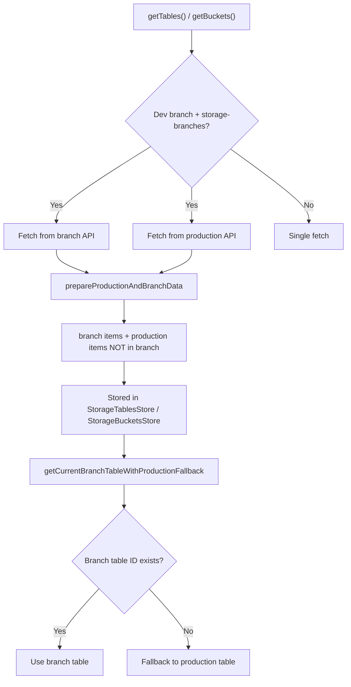

The merging of branch and production tables/buckets in `keboola/ui` operates at two distinct levels: **data fetching** (API layer) and **table resolution** (UI/helper layer). Here's how each works:

---

## 1. Fetching: `prepareProductionAndBranchData`

When the user is on a dev branch and the project has the `storage-branches` feature, both `getBuckets()` and `getTables()` in `StorageApi.js` make **two parallel API calls** — one scoped to the current branch and one to production (the default branch):

```js
// StorageApi.js
return Promise.props({
  branch: loadTables(),
  production: loadTables({ forceProduction: true }, 'buckets,columns,metadata'),
}).then(prepareProductionAndBranchData);
``` [0-cite-0](#0-cite-0) 

The merge logic itself is in `prepareProductionAndBranchData`:

```js
const prepareProductionAndBranchData = ({ branch, production }) => {
  const branchIds = branch.map((row) => row.id);
  return branch.concat(production.filter((row) => !branchIds.includes(row.id)));
};
``` [0-cite-1](#0-cite-1) 

**The rule is simple: branch wins.** It collects all IDs from the branch response, then appends only those production rows whose ID is *not* already present in the branch set. So if a table/bucket exists in both branch and production, the **branch version** is kept and the production version is discarded.

The same pattern applies identically to `getBuckets()`: [0-cite-2](#0-cite-2) 

---

## 2. Single-entity fetching: `withProductionFallback`

For fetching a **single** table or bucket (e.g. `getTable(tableId)`, `getBucket(bucketId)`), a different strategy is used — `withProductionFallback`:

```js
export const withProductionFallback = (entityId, request) => {
  const branchId = StorageTablesStore.hasTable(entityId)
    ? StorageTablesStore.getTable(entityId).getIn(['bucket', 'idBranch'])
    : StorageBucketsStore.getBucket(entityId, Map()).get('idBranch');
  const isProduction = branchId === DevBranchesStore.getDefaultBranchId();

  return request({ forceProduction: isProduction }).catch((error) => {
    if (!ApplicationStore.hasStorageBranches() || isProduction) {
      throw error;
    }
    return request({ forceProduction: true });
  });
};
``` [0-cite-3](#0-cite-3) 

It checks the locally-cached `idBranch` of the entity to decide whether to hit the branch or production endpoint. If the request to the branch endpoint fails with a 404, it **falls back to production**. This is also replicated in the newer `createStorageBranchMiddleware` for the api-client: [0-cite-4](#0-cite-4) 

---

## 3. UI-level resolution: `getCurrentBranchTableWithProductionFallback`

When the UI needs to look up a table from the already-loaded (merged) store, it uses `getCurrentBranchTableWithProductionFallback`:

```js
const getCurrentBranchTableWithProductionFallback = (allTables, tableId) => {
  if (!tableId) return Map();
  return allTables.get(getBranchTableId(tableId), allTables.get(tableId, Map()));
};
``` [0-cite-5](#0-cite-5) 

It first tries to find the table under its **branch-prefixed ID** (computed by `getBranchTableId`), and if that doesn't exist, falls back to the original (production) table ID: [0-cite-6](#0-cite-6) 

This is used extensively in input/output mapping editors to resolve the correct table metadata regardless of whether the table exists only in the branch, only in production, or in both. [0-cite-7](#0-cite-7) 

---

## 4. Bucket filtering helpers

The helpers module provides functions to filter the merged bucket list for display purposes:

- `filterProductionBuckets` — excludes any bucket created in a dev branch
- `filterDevBranchBuckets` — includes only dev-branch-created buckets
- `filterProductionAndCurrentDevBranchBuckets` — includes production buckets **plus** buckets created by the *current* dev branch (identified via `KBC.createdBy.branch.id` metadata or `idBranch`)
- `filterProductionAndCurrentDevBranchTables` — filters tables to those belonging to the filtered bucket set [0-cite-8](#0-cite-8) 

---

## Summary diagram



In short: the system always prefers the branch version of a table/bucket. Production data is only included when there is no corresponding branch override.